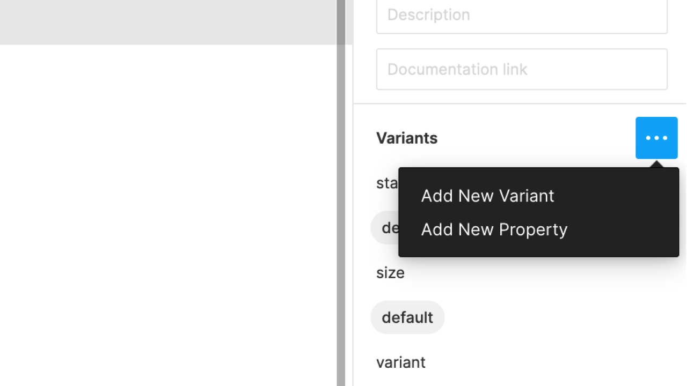

I've seen figma variants done with and without component nesting, and at this point made a button both ways. Having gone through the process a few times I feel pretty confident in using controller components to build out variants. My key takeaway: **variants are like props and should be used to toggle states**. You don't want to be building core UI within the variant setup, you just want to hook it all up. Either way its a tedious process– but the end result is pretty rad.

Along with using controller components, it's important to do some prep work before you start building out each variant. I'll go through how I plan for variants before touching my figma file.

## Controller component

Build a base level component to act as a "controller" for each variant. This is where you could control **border radius, margins/padding, size, autolayout, and ordering/layout.** 

It's great if you have a rough idea for reach property before you start, but as you build out variants you can easily make new controllers. I started with my default button height and sizing, then later added specific controllers for icon buttons so I could utilize autolayout. Once I was happy with my default set, I made copies of each controller and added `small` and `large` sizes. Now if I want to make my large buttons GIANT, I only have to change it in 6 places (vs 34)


## Planning for variants

Step away from your figma file for a minute. Maybe do a little research by looking at [other design systems](https://designsystemsrepo.com/design-systems/). **Make a list of every variant you think you might need**. I'm usually a build only what you need when you need it person, but in this case its much easier to have a little plan before you start. The same goes for actually architecting a component with code– the clearer picture you have of the different props, the better.

Here's my list for Button

- state [default, hover, disabled]
- size [small, default, large]
- variant [primary, secondary]
- outlineBtn [true/false]
- loading [true/false]
- iconLeft [true/false]
- iconRight [true/false]
- iconOnly [true/false]
- fullWidth [true/false]

Use whatever naming convention feels good. I'm using camelCase to make it easier to transfer this to JS.

Take that list and define every property for the first Button variant. Figma is looking for a specific format. It should look like this:

<div className="codeBlock">

```css
state=default, size=default, variant=primary, outlineBtn=false, loading=false, iconLeft=false, iconRight=false, iconOnly=false, fullWidth=false
```

</div>

## Alright, back to your figma file

Make a new frame and copy your button_controller into it. Do not detach instance. It should look something like this:


Make that new frame Button a component. This is what we will base our variants off of. Style this first component while still using the controller. The only changes I really made to Button are colors and some autolayout to allow for fullWidth. Click the plus sign under Variants to enable, but instead of manually adding props (it takes forever) just copy paste the list above into the name of the first button in the layers panel.

You can do the same thing here but it will take 5x longer (Add New Property)



## Onward

Now when you make a new variant, you can simply make whatever design adjustments you want and change any of the props you already created! You can continue changing props via text in the variant name or through the variants panel. Having a prop-plan ahead of time will allow you to more easily build each variant and hopefully prevent any major oversights that generally mean you have to start over. 

Feel free to check out my <a href="https://www.figma.com/file/WOrTkNOlTlHPpqt4b0n9cc/Button-Components-with-Controllers-Full-Variants?node-id=0%3A1" alt="figma file" target="_blank" rel="noopener noreferrer">figma file</a> for Button as a reference or to use in your own system!