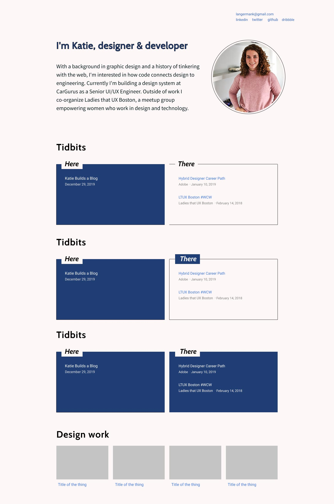

After building a few Gatsby sites for other projects I finally decided to move my old wordpress site on over. And not only that, but totally redesign it to be more of a landing page for myself with the ability to write some simple blog posts. Historically this has always been a portfolio site with really complex pages for previous client work I've done, but it didn't feel relevant or useful anymore. My plan is to create some dribbble shots of a few projects and link to them from here.

I had planned to use the new gatsby theming option for this since there are a number of awesome looking blog themes available. I experimented with a few to see what the setup and utilization process is like, but in true Katie fashion I just didn't love the override aspect of it. This exploration gave me a lot of ideas for how to structure the existing site so definitely worth the time and effort. But after all that I realized I just wanted a totally clean slate to start, and all I would need to do is add <a href="https://www.gatsbyjs.org/packages/gatsby-plugin-mdx/" alt="gatsby mdx plugin" target="_blank" rel="noopener noreferrer">mdx</a> and <a href="https://www.gatsbyjs.org/packages/gatsby-source-filesystem/" alt="gatsby source filesystem plugin" target="_blank" rel="noopener noreferrer">gatsby-source-filesystem</a>.

## the technical stuff

After setting up the basics with the default starter (like adding eslint rules and some basic styling), I followed the <a href="https://www.gatsbyjs.org/docs/mdx/programmatically-creating-pages/" alt="gatsby mdx programmatically creating pages" target="_blank" rel="noopener noreferrer">guide</a> for implementing gatsby-source-filesystem and programmatically creating pages, which I ended up needing for more than just blog posts.

I also created a posts page template using MDXRenderer to grab the contents of each mdx post. I went with mdx instead of just markdown because I use mdx for internal style guide documentation at work, so I'm already comfortable with it. I like having the ability to bring in React components if I need to and the setup is very similar to markdown.

The only issue I ran into with this system is rendering a list of posts on the homepage. As you can see in my gatsby-config I also have a folder called `text` which are markdown files containing large chunks of text that I render as a component `<Text/>`. Since I set up a query on the homepage to grab the mdx files and map to a list, those non-blogpost markdown files were also being listed. I think I could have solved this issue in a more robust way, but my solution was to filter the `allMdx` query to **only** the `/posts/` directory.

## the design stuff

In true hybrid fashion I mostly designed this site in the browser as I developed it. In this case I approached the design slightly backwards- I built the thing, basically creating a skeleton of content and typography, and then I imported it into Figma with <a href="https://www.figma.com/c/plugin/747985167520967365/HTML-To-Figma" alt="html to figma plugin" target="_blank" rel="noopener noreferrer">html-figma</a> to have the ability to drag items around my canvas.

This approach worked _really_ well for me. At first I felt overwhelmed that I didn't have **THE** idea for the design. Nothing was really hitting me while I was in the code. But the moment I brought it into Figma I felt like I had more room to explore and iterate. I started by moving things around and playing with details like borders, inverse text/background, and shapes. I generated a palette using <a href="https://palx.jxnblk.com/" alt="palx palette generator" target="_blank" rel="noopener noreferrer">palx</a> with my go-to shade of red and landed on the lightest hint of pink with dark navy. It felt like *me*. I explored different treatments of the **Tidbits** section. All of these things are easier for me to accomplish on an artboard, and once something sticks I'll take it into the code to refine and systemize.

### a note on typography

I think this probably deserves its own post. But long story short, I heard <a href="https://rwt.io/" alt="Jason Pamental" target="_blank" rel="noopener noreferrer">Jason Pamental</a> talk about variable fonts on the new <a href="https://www.smashingmagazine.com/2019/12/smashing-podcast-episode-5/" alt="Smashing Magazine podcast variable font episode" target="_blank" rel="noopener noreferrer">Smashing Magazine podcast</a> and **knew** it was time to investigate. This would be my opportunity to go down that rabbit hole. And oh, what a joy! My background is in graphic design. So much of my education was around typography, and I hadn't **really** thought about it in this way for a LONG time. But reading about variable fonts and deeply looking into what's currently available to buy or download was a nice reminder of my design background. And why I love it. Even 5 years after college I still love the same typefaces as I did in school. **All this to say**, <a href="https://en.wikipedia.org/wiki/Gill_Sans" alt="Gill Sans font wiki" target="_blank" rel="noopener noreferrer">Gill Sans</a> was my first love and I found a variable font called <a href="https://v-fonts.com/fonts/cabin-vf" alt="Cabin variable font" target="_blank" rel="noopener noreferrer">Cabin</a> that is similar. So I started playing with that, and also introduced <a href="https://v-fonts.com/fonts/source-sans-variable" alt="Source Sans variable font" target="_blank" rel="noopener noreferrer">Adobe's Source Sans Variable</a> for body copy. Cause' why not? I'm not 100% happy with how it all looks but I'm excited to keep messing with it.

## final thoughts

So far I'm enjoying my new gatsby blog. Deploying with netlify is super easy and fast, and I love that I don't need to deal with a host anymore. Next I'll be adding some links to dribbble shots showcasing some previous design work, and potentially linking to some codepens. I'd like to use this site as a playground for some creative ideas I have. Like a nice little escape from normal work stuff, potentially more along the lines of graphic design.